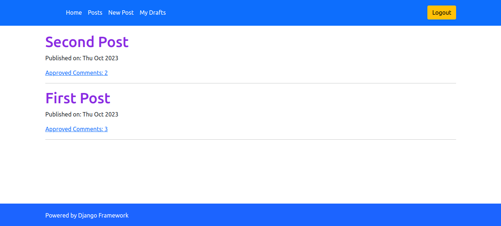

# Blog for users and posts



## How to Run

1. Navigate to the `blog` directory.

2. Create a virtual environment and activate it, then install the required dependencies:

    ```bash
    pip install -r requirements.txt
    ```

3. Run the Django server:

    ```bash
    python manage.py runserver
    ```

4. Open your browser and visit http://127.0.0.1:8000/ url.


## License
This project is licensed under the MIT License.
Feel free to customize and modify the above template according to your specific project requirements.