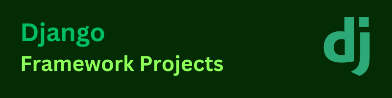

# Django Projects

This repository contains a collection of projects developed using the Django framework with Python.

## Introduction to Django

[Django](https://www.djangoproject.com/) is a high-level web framework written in Python that follows the model-view-controller (MVC) architectural pattern. It provides a robust set of tools and features for building web applications quickly and efficiently.

With Django, you can focus on writing your application's logic and business rules, while it takes care of handling common web development tasks such as URL routing, database management, form handling, authentication, and security.

## Key Features of Django

- **Batteries Included**: Django comes with a wide range of built-in features, including an object-relational mapper (ORM) for database management, an intuitive administrative interface, authentication and authorization systems, form handling, caching, and more. This allows developers to get started quickly without having to build these features from scratch.

- **Scalability and Reusability**: Django follows the Don't Repeat Yourself (DRY) principle and encourages reusable and modular code. Its component-based structure and support for apps and packages make it easy to scale and maintain large projects.

- **ORM and Database Support**: Django's ORM provides a convenient way to interact with databases, supporting various database backends such as PostgreSQL, MySQL, SQLite, and Oracle. It abstracts away the complexities of writing raw SQL queries and offers an expressive API for querying and manipulating data.

- **Template Engine**: Django's template engine allows you to separate the presentation layer from the business logic. It provides a powerful syntax for rendering dynamic content and supports template inheritance, filters, tags, and template tags for creating reusable templates.

- **URL Routing**: Django's URL routing system allows you to map URLs to views, making it easy to define the structure of your application's URLs and handle incoming requests.

- **Security and Authentication**: Django implements various security measures by default, including protection against common web vulnerabilities such as cross-site scripting (XSS), cross-site request forgery (CSRF), and SQL injection. It also provides built-in user authentication and authorization mechanisms.

## Projects in this Repository

This repository contains multiple projects that showcase the capabilities of Django and demonstrate different use cases and functionalities. Each project is organized in its own directory and comes with its own README.md file, providing detailed instructions on installation, usage, and contributing.

Feel free to explore the individual project directories to learn more about each project and how to run them.

## Contributing

Contributions are welcome! If you'd like to contribute to any of the projects in this repository, please follow these guidelines:
- Fork the repository
- Make your changes
- Submit a pull request

## License

This repository is licensed under the [MIT License](LICENSE).
